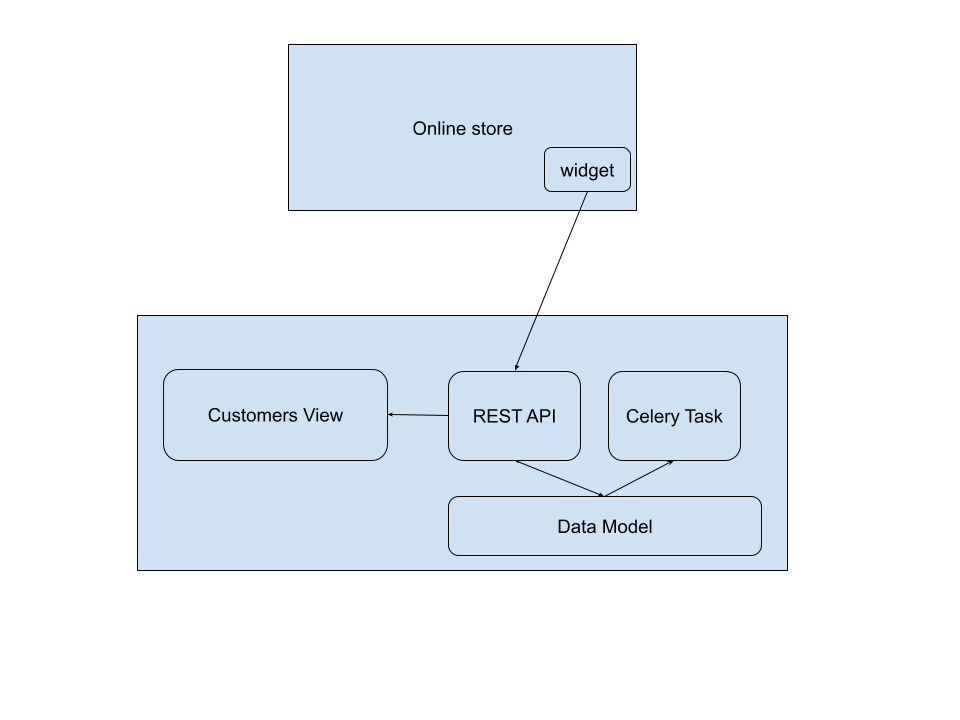

# Product Engineer at Konigle 
Thank you for interviewing with us! Konigle is a collection of tools to help an online store scale. These tools help an online store save time, reduce costs and increase sales, hence improve their profitability. 

Konigle is a complex product being shipped at very high velocity to solve urgent and important needs for online stores. To help us ship fast, we have architected our product around a tech stack that is simple and well understood. Konigle is a web first product and each seller tool inside Konigle is a Django application with it's own data models and simple UI. 

As a full stack engineer, you would have an opportunity to build, maintain and scale complete seller tools. In order to give you a feel of the actual work that you will be doing, this task in itself is a hypothetical toy seller tool that should take you not more than 4 hours to prototype. Let's call this 
seller tool --> *Unity*

## Unity
Creating an email list with consent to target with promotional emails is a cost effective way to increase sales. Infact, studies have shown that email
marketing has ~42000% ROI. Unity is a simple seller tool that helps an online store maintain an email list. It consists of a widget installed an online store and a Django application which will provide the ability to manage these new customers.



Here is the brief functionality of the seller tool
- A widget pops up on the online store and prompts the store visitor to signup using email address
- The signup data will be sent to an API provided by the Django app (Unity backend)
- The app stores the data in its own model
- The app exposes a view which 
	1.  lists down the emails in the reverse chronological order of their  timestamp
	2. Shows the number of new emails in the current calendar month
- The app sends an email to the seller every Monday and Wednesday including the statistics around the email list

## Installation
-   Install docker, docker-compose
-   Run ```docker-compose up -d --build```
-   The mailing list dashboard is at http://localhost:1337/subscribers/dashboard
-   Test widget page: <project_path>/unity/widgets/test/store.html
-   Check celery task log: ```docker-compose logs -f 'celery'```

